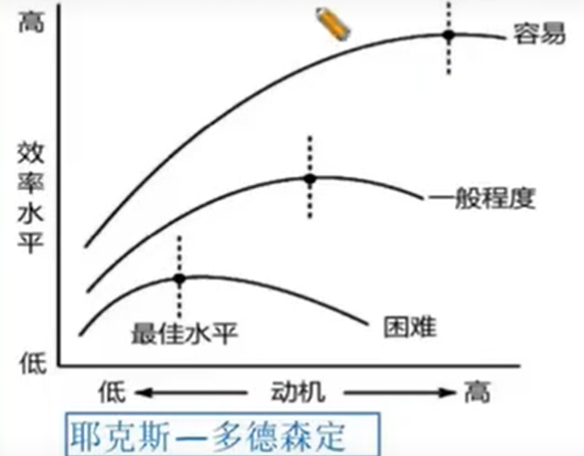

# 科目二 《教育知识与能力》

## 选择题

### 教育学

### 心理学

#### 认知基础

| 模块 | 概念                                                         | 特点                                       |
| ---- | ------------------------------------------------------------ | ------------------------------------------ |
| 感觉 | 人脑对当前直接作用于感觉器官的客观事物的个别属性的反映       | 认识世界的开端，知识的源泉，心理活动的基础 |
| 知觉 | 人脑对当前直接作用于感觉器官的客观事物的`整体`属性的反应     | 语义理解                                   |
| 注意 | 人的心理活动对一定对象的`指向`和`集中`，是心理过程的动力特征之一。 |                                            |
| 记忆 | 人脑对过去经验的保持和再现                                   |                                            |
| 想象 | 人脑对已储存的表象进行加工改造，形成新形象的心理过程         |                                            |
| 思维 | 人脑对客观事物本质特征和内在规律性联系的间接的概括的反应。   | 间接性、概括性                             |

#### 8.思维的种类

| 思维分类依据       | 具体内容                                                |
| ------------------ | ------------------------------------------------------- |
| 思维活动凭借物不同 | 1、感知动作思维 2、具体形象思维 3、抽象逻辑思维 |
| 探索目标方向不同   | 1、集中性思维 2、发散性思维                         |
| 创新程度不同       | 1、常规性思维 2、创造性思维                         |

#### 9.创造性思维的基本特征

美国心理学家：吉尔福特

| 特征   | 含义               |
| ------ | ------------------ |
| 流畅性 | 数量的多少         |
| 变通性 | 随机应变，不同类型 |
| 独创性 | 不常规、新奇性     |

#### 10.影响问题解决的因素

| 因素               | 解释                                     |
| ------------------ | ---------------------------------------- |
| 问题情境与表征方式 | 客观情境                                 |
| 个体的智能与动机   |                                          |
| 功能固着           | 只看到一种用途，消极的                   |
| 思维定势           | 熟悉的方式做出反应，既有消极的又有积极的 |
| 原型启发           | 从其他事物上找到方法                     |
| 酝酿效应           |                                          |
| 情绪状态           |                                          |
| 已有的知识经验     |                                          |

#### 学习理论

| 学习理论                                          | 含义                                                         | 代表人物                 |
| ------------------------------------------------- | ------------------------------------------------------------ | ------------------------ |
| 行为主义学习理论、学习的联结理论、“刺激-反应”理论 | 学习就是在刺激与反应之间建立联结的过程。强化在“刺激-反应”联结的建立中起着重要的作用 | 巴甫洛夫、桑代克、斯金纳 |
| 认知主义学习理论                                  | 研究人类复杂行为时，要关系刺激-反应的中间过程，即刺激是怎样引起反应和学习行为内在的机制是什么。他们认为，刺激与反应之间的联系是以意识为中介的，强调认知过程的重要性，即学习是”S-O-R“的公式 | 苛勒、布鲁纳、奥苏伯尔   |
| 建构主义学习理论                                  |                                                              |                          |
| 人本主义学习理论                                  | 强调人的正面本质和价值，关注人的成长和发展，并将其成为自我实现。 | 马斯洛、罗杰斯           |

#### 11.行为主义学习理论

 

| 人物     | 实验             | 学说               | 内容                                                         |
| -------- | ---------------- | ------------------ | ------------------------------------------------------------ |
| 桑代克   | 饿猫迷箱         | 尝试错误说、试误论 | 基本观点：学习的过程是一种渐进的、盲目的、尝试错误的过程 学习定律： 准备律-预习、动机 练习律-做题、正确重复 效果律-反馈最重要 |
| 巴甫洛夫 | 狗分泌唾液       | 经典条件作用论     | 获得 消退 刺激泛化 刺激分化                      |
| `斯金纳` | 白鼠杠杆操作实验 | 操作性条件作用论   | 强化 消退 惩罚                                       |
| 班杜拉   | 波波玩偶         | 社会学习理论       | 替代性学习（观察学习）：通过观察别人而进行的学习 直接强化：直接奖励的对象 替代性强化：学习者通过观察榜样受强化而受到的强化 自我强化：自己奖励自己 |

##### 斯金纳强化理论

| 项目 |        | 条件         | 行为发生频率 | 例子       |
| ---- | ------ | ------------ | ------------ | ---------- |
| 强化 | 正强化 | 增强愉快刺激 | +            | 表扬、奖励 |
| 强化 | 负强化 | 减少厌恶刺激 | +            | 撤销处分   |
| 惩罚 | 正惩罚 | 增强厌恶刺激 | -            | 体罚、谴责 |
| 惩罚 | 负惩罚 | 减少愉快刺激 | -            | 减少零花钱 |
| 消退 |        |              | -            | 不予理睬   |

#### 13.学习动机

| 分类依据               | 名称           | 解释                   |
| ---------------------- | -------------- | ---------------------- |
| 动机产生的诱因来源     | 内部动机       | 对活动本身有兴趣       |
|                        | 外部动机       | 由外部诱因激发出的动机 |
| 社会意义               | 高尚动机       | 为社会做贡献           |
|                        | 低级动机       | 自我为中心，利己主义   |
| 动机作用时间长短       | 近景直接动机   | 近期目标               |
|                        | 远景间接动机   | 长远目标               |
| 学习成就、奥苏伯尔动机 | 认知内驱力     | 了解知识               |
|                        | 自我提高内驱力 | 地位和威望需要         |
|                        | 附属内驱力     | 长者或同伴的赞许和接纳 |

#### 14.学习动机和学习效果关系

耶克斯-多得森定律

耶克斯-多得森定律内容

1. 倒U型曲线
2. 中等强度，学习效率最好
3. 任务难度较大-最佳动机较低
4. 任务难度简单-最佳动机较高

#### 15.韦纳成败归因理论

| 归因类别 | 稳定性 |        | 因素来源 |      | 能控制性 |          |
| -------- | ------ | ------ | -------- | ---- | -------- | -------- |
|          | 稳定   | 不稳定 | 内部     | 外部 | 能控制   | 不能控制 |
| 能力     | W      |        | X        |      |          | X        |
| 努力     |        | X      | X        |      | V        |          |
| 工作难度 | W      |        |          | X    |          | X        |
| 运气     |        | X      |          | X    |          | X        |
| 身心状况 |        | X      | X        |      |          | X        |
| 其他     |        | X      |          | X    |          | X        |

不是学习的料，能力

努力是唯一可控的因素

如果总是把失败归因为能力低，会容易：习得性无助

#### 16.学习迁移的分类

学习迁移是指一种学习对另一种学习的影响。学习活动总是建立在已有的知识经验之上，这种利用已有的知识经验不断地获得新的知识和技能的过程，就是学习迁移。

| 分类依据           | 名称                 | 解释                                                         | 例子                                                       |
| ------------------ | -------------------- | ------------------------------------------------------------ | ---------------------------------------------------------- |
| 迁移的性质         | 正迁移               | 一种学习对另一种学习产生积极的影响，两种学习之间相互促进。   | 英语学习对法语学习十分有利                                 |
|                    | 负迁移               | 一种学习对另一种学习产生消极的影响，两种学习之间相互干扰。   | 汉语拼音对英语学习不利                                     |
| 迁移发生的时间顺序 | 顺向迁移             | 先前学习对后继的学习的影响，有正负之分                       | 学了初等数学对学习高等数学产生影响                         |
|                    | 逆向迁移             | 后继学习对先前的学习的影响，有正负之分                       | 学了高等数学加深了对初等数学的理解                         |
| 迁移的概括水平     | 垂直迁移、纵向迁移   | 不同概括水平的两种学习之间的相互影响                         | 学了苹果，可以再学习水果                                   |
|                    | 水平迁移、横向迁移   | 同一概括水平的经验之间的相互影响                             | 学了苹果，可以再学习桔子                                   |
| 迁移的内容不同     | 一般迁移、非特殊迁移 | 将原理、原则和态度具体化，运用到具体的事例中                 | 从数学学到的方法，应用到物理的学习中去                     |
|                    | 具体迁移、特殊迁移   | 学习迁移发生时，学习者原有的经验组成要素以及结构没有变化，只是重新组合并移用到另一种学习中 | 学了日组合成晶，木组成森，日，月组成明                     |
| 其他               | 同化性迁移           | 不改变原有结构                                               | 举一反三、闻一知十                                         |
|                    | 顺应性迁移           | 改变原有的知识                                               | 原来以为空气没有质量，看了科教之后，明白了空气也是有质量的 |
|                    | 重组性迁移           | 成分不变，顺序变                                             | on->no, live->evil, tea-eat                                |

## 三、教育目的

